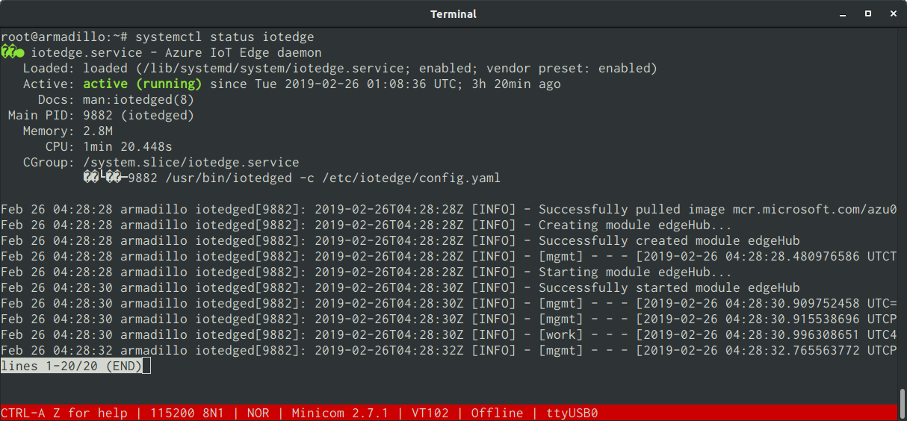
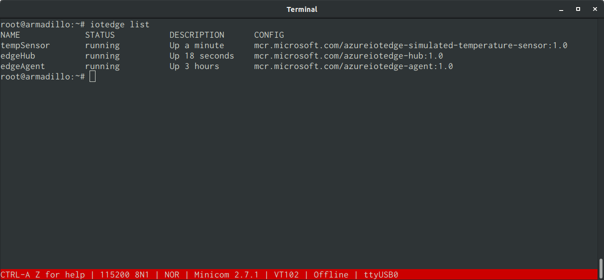

# Table of Contents

-   [Intoduction](#Introduction)
-   [Step 1: Perequisites](#Prerequisites)
-   [Step 2: Prepare your Device](#PrepareDevice)
-   [Step 3: Manual Test for Azure IoT Edge on device](#Manual)

<a name="Intoduction"></a>
# Intoduction

**About this document**

This document descibes how to connect Armadillo-IoT Gateway G3 M1 model device running Debian GNU/Linux 9 with Azure IoT Edge Runtime. This multi-step process includes:

-   Configuing Azure IoT Hub
-   Registeing your IoT device

<a name="Perequisites"></a>
# Step 1: Perequisites

You should have the following items eady before beginning the process:

-   [Prepare your development environment](https://github.com/Azure/azure-iot-sdk-c/blob/master/doc/devbox_setup.md)
-   [Setup your IoT hub](https://account.windowsazure.com/signup?offer=ms-azr-0044p)
-   [Add the Edge Device](https://docs.microsoft.com/en-us/azure/iot-edge/quickstart-linux)
-   [Add the Edge Modules](https://docs.microsoft.com/en-us/azure/iot-edge/quickstart-linux#deploy-a-module)
-   Armadillo-IoT Gateway G3 M1 model device.

<a name="PrepareDevice"></a>
# Step 2: Prepare your Device

Armadillo-IoT Gateway G3 M1 model supports Azure IoT Edge with Linux kernel version x1-v4.9-at3 or later.

You can check Linux kernel version running on your device with following command:

```
$ uname -a
```

If your device uses older kernel, you must upgrade it.
See the following document to upgrade the kernel on your device:

- [Armadillo-IoT Gateway G3 Product Manual](https://manual.atmark-techno.com/armadillo-iot-g3/armadillo-iotg-g3_product_manual_ja-2.0.2/ch11.html#sct.update_image_simply.linux)
  - Currently, this document is only japanese version yet.

And, see the following document to install Azure IoT Edge runtime on your device:

- [Install Azure IoT Edge runtime on Linux (ARM32v7/armhf)](https://docs.microsoft.com/azure/iot-edge/how-to-install-iot-edge-linux-arm)

<a name="Manual"></a>
# Step 3: Manual Test for Azure IoT Edge on device

<a name="Step-3-1-IoTEdgeRunTime"></a>
## 3.1 Edge RuntimeEnabled (Mandatoy)

**Details of the equirement:**

The following components come pe-installed or at the point of distribution on the device to customer(s):

-   Azure IoT Edge Security Daemon
-   Daemon configuation file
-   Moby containe management system
-   A vesion of `hsmlib` 

**Check the iotedge daemon command:** 

Open the serial console on your IoT Edge device, confirm that the Azure IoT edge Daemon is under running state.

```
# systemctl status iotedge
```

 

And confirm that the module deployed from the cloud is running on your IoT Edge device

```
# iotedge list
```

 

On the device details page of the Azure, you should see the runtime modules - edgeAgent, edgeHub and tempSensor modueles are under running status.

 
